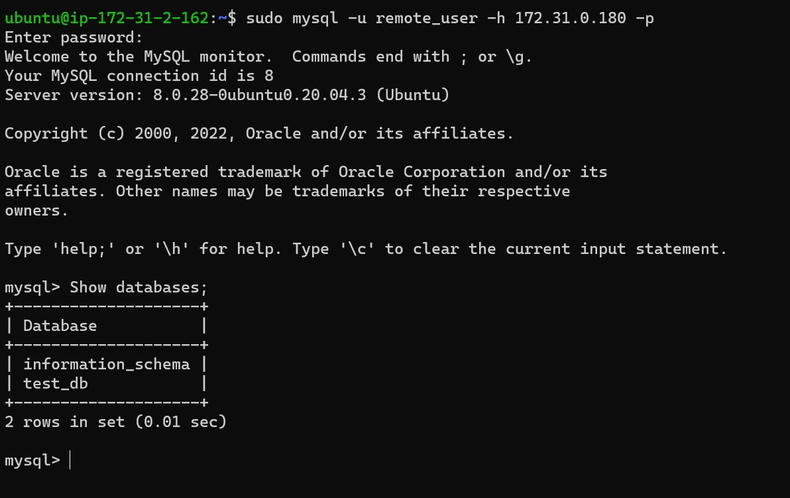

##  Client/Server Architecture Using A MySQL Relational Database Management System

**Server A name - `mysql server`**

`sudo apt update`

`sudo apt install mysql-server`

`sudo systemctl enable mysql`

`sudo mysql_secure_installation`

`sudo mysql`

`CREATE USER 'remote_user'@'%' IDENTIFIED WITH mysql_native_password BY 'password';`

` CREATE DATABASE test_db;`

` GRANT ALL ON test_db.* TO 'remote_user'@'%' WITH GRANT OPTION;`

` FLUSH PRIVILEGES`

`sudo vi /etc/mysql/mysql.conf.d/mysqld.cnf`

`sudo systemctl restart mysql`

**Server B name - `mysql client`**

`sudo apt update`

`sudo apt install mysql-client`

`sudo mysql -u remote_user -h 172.31.0.180 -p`

